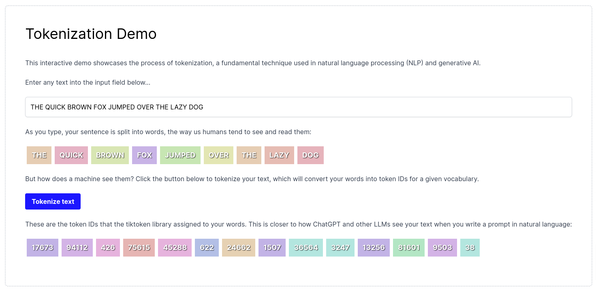

# Tokenization Demo 

### Understand how Large Language Models (LLMs) see your context and prompts



### Built With

- Next.js + tailwind
- The `Tiktoken` library
- Node version 20 or higher

---

### Start the project

**Requires Node version 20+**

From the project root directory, run the following command.

```bash
npm install
```

There are no required environment variables for this project, and this project does not use any 
third party services that cost money. It simply passes the text input on the frontend to the 
backend API route which tokenizes the text using `Tiktoken`.

Start the app.

```bash
npm run dev
```

## Project structure

In this example we opted to use Next.js and the app router, which colocates the frontend and backend code in a single repository.

**Frontend Client**

The frontend uses Next.js and tailwind to allow users to enter free form text. This text is split by word on the client-side and then converted to tokens by the `tiktoken` library 
when the user clicks the `Tokenize text` button. 

The `tiktoken` library looks up and assigns each word an ID according to its vocabulary.

**Backend API route**

This project exposes an API route: `/api/tokenize`, that uses the `Tiktoken` library to tokenize text that it receives from the frontend: 

```typescript
import { NextRequest, NextResponse } from 'next/server';
import { encodingForModel } from "js-tiktoken";

export async function POST(req: NextRequest) {

  try {
    const enc = encodingForModel('gpt-3.5-turbo');

    const { inputText } = await req.json();
    console.log(`inputText: ${inputText}`);

    const tokens = enc.encode(inputText);

    return NextResponse.json({ tokens }, { status: 200 });
  } catch (error) {
    return NextResponse.json({ error }, { status: 500 });
  }
}
```
